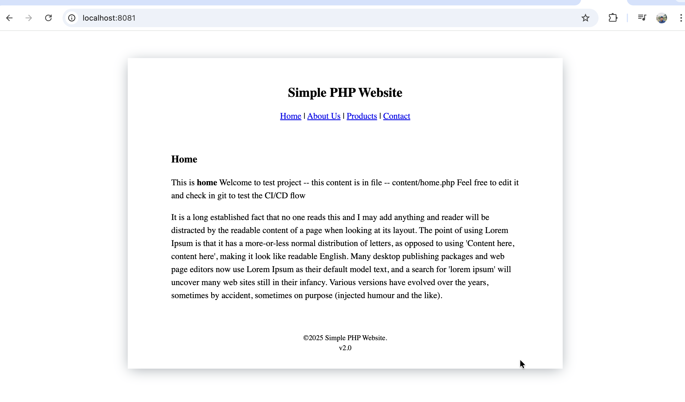

# PHP Web Application with DevOps

This project demonstrates running a **PHP web application** using Jenkins as an modern CI Tool & Docker as CD tool. The setup includes building a Docker image, running a container, and optional CI/CD integration with Jenkins. 
Here, Ubuntu Master Node is used to install all required softwares in test-server node which is a fresh ubuntu instance which acts as an agent in Jenkins Pipeline.

---

## Project Logo

